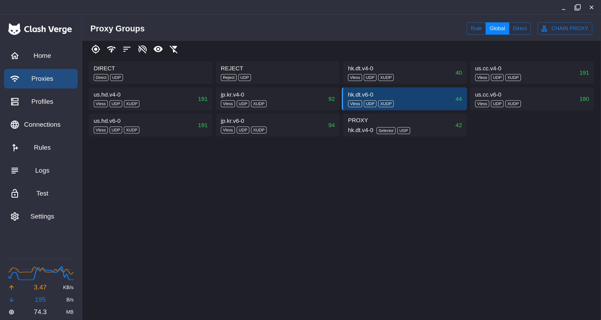

## 0. 背景

首先校园网计费只针对 ipv4 的下行流量, 也就是说我们可以让流量走 ipv6 来实现校园网免流. 但是大部分情况下流量都走得 ipv4, 我们需要一种手段来强制流量走 ipv6. 此处介绍租用 vps, 利用 3x-ui 转发流量来实现免流.

## 1. 租 vps

商家把一台物理服务器通过虚拟化技术拆分成多台小机器来卖, 而用户买到的就是 vps. 对于代理用途, 一般 1核心1GB 的 vps 就已经够用了. 洛杉矶的一般比较便宜, 但是延迟高稳定性不太好; 香港的用不了国外的 ai. 本文介绍采用的是 debian 系统.

## 2. 3x-ui 前的配置

租完 vps, 我们 ssh 上服务器(输入密码的时候不显示东西是正常的...), 然后通过命令行管理.

```
# 一般的 ssh 命令格式, 尖括号是指定证书, 一般用密码登录即可, 但是有些商家强制你用 sshkey.
ssh <user_name>@<ip> [-i path/to/sshkey.pem]
```

ssh 登录服务器之后, 我们先更新系统, 安装一些工具, 安装 3x-ui 本身, 以及用 ufw 管理端口.

```bash
# 因为大部分情况下都进 root 账户故没用 sudo
# 更新软件列表
apt update
# 下载工具
apt install ufw curl
# 下载 3x-ui; 链接可以直接上 github 找 3x-ui 官方仓库的 install.sh, 查看 raw 的地址.
bash <(curl -Ls https://raw.githubusercontent.com/MHSanaei/3x-ui/refs/heads/main/install.sh)

# ufw 管理端口
ufw allow 22/tcp    # ssh 端口
ufw allow 80/tcp    # tls 证书获取
ufw allow 443/tcp   # 走 reality 建议的入站端口
ufw allow 1234/tcp  # 自己选一个面板端口
# 启动 ufw
sudo ufw enable
```

## 3. 配置 3x-ui

在命令行中输入 `x-ui` 进行管理(忘了安装完 3x-ui 后面会让你配置什么了).

- 7: 更改面板的用户名和密码
- 10: 更改面板端口
- 26: 开启 BBR
- 11: 查看当前配置

在 11 中可以看到当前配置下有一个 **Access URL**, 这个东西就是面板的访问地址.

## 4. 配置入站

访问前面的 Access URL, 输入之前配置的面板用户名和密码. 登录进去后, 首先我们配置订阅, 左侧 Panel Settings -> Subscription. 如果用 clash(mihomo) 系, **Clash / Mihomo subscription** 需要开启, 然后面板建议把 **URI Path** 给改改. **这个改动除了要保存, 还需要重启面板**.

配置完订阅, 左侧菜单点击 Inbound, 然后 Add Inbound.

- Basics
  - remark: 随意
  - Protocol: vless
  - Address: 填写服务器的 ipv6 地址
  - Share address strategy: Inbound listen
  - *Disable XTLS flow*: 如果用 xhttp, 需要开这个.
  - Port: 443
- Protocol
  - 点击 generate 生成密钥.
- Stream
  - *Transmission*: raw 也可以, 如果为了混淆可以用 xhttp, 但是得自己改.
- Security:
  - Security: Reality
  - Target: 自己找个能用的()
  - *Min Client Ver*: 如果用 clash 系的代理软件, 建议填 1.0.0

改完之后保存. 左侧点击 Clients, 然后 Add Clients.

- Basics
  - Email: 随意
  - Attached inbounds: select all

保存之后可以看到 QR code, 复制链接可以直接导入 V2rayN(需要手动更新订阅), clash 等软件.

## -1. misc

Xray 关于 Reality 的日志写的好烂, debug 级别的日志在认证失败的时候也只显示认证失败了.

入站的 Target 目标不知道为什么有些域名在 Find Targets 中显示可用, 但是实际上配置好之后用不了, ~~之前好像日志看到过有时证书太长会导致问题, 但是现在还没明确原因.~~

> **2026.9.17**: 别开ML-DSA-65! 在握手的时候服务器需要构造一个假证书, 开启这玩意, 需要在证书里面放一个 3309 字节的签名, 约 3.3KB(Ed25519 签名只有 64 字节), 为了抗封锁, 构造的假证书会被补齐到目标网站的证书长度, 但是对于很多网站而言这个签名就比他们的证书长, 由于假证书长度不能减少, 所以和真证书长度对不上, 会导致 Xray 认证失败.

3x-ui 3.7.0 版本的时候加入了 Share address strategy, Address 中填入 ipv6 地址可以不用手动把 v4 地址改掉(以前订阅端口忘开, 用配置导入的时候经常需要手动改). 同时 3.7.0 版本加入了 Disable XTLS flow 摁钮, 印象中旧版能同时开 xhttp+xtls 且能正常代理, 但是这俩配置是不兼容的, 印象里遇到过没开这个 Disable XTLS flow 导致没法用 xhttp 只能用 raw 的情况, 但是默认流控好像应该是 none 来着. 从旧版本更新到新版本的时候, 似乎默认 Share address strategy 是 Node Address, 这会导致旧的监听 ipv6 的配置不可用.

Xray 在 v26.7.11 及以上版本中会自动加入 MinClientVer 这个字段, 而这个字段在 mihomo 内核中固定且默认为 1.8.2, 这会导致更新 Xray 内核后原本的配置在 clash 等软件上用不了. 好像 Xray 和 mihomo 的仓库都有人提 issue 和 pr 想修改, 但是似乎都被关闭了. 好像老的 Xray 内核下我同样的配置能连上 hk vps, 但是其余地方的 vps 经常容易连不上, 不知道应该归因于就版本 Xray 的抗封锁能力差, 还是说旧版本 3x-ui 容易配置混乱.

如果你有很多 vps, 可以尝试在一个 vps 的 Nodes 中加入其余 vps, 来统一管理. 可以尝试配置 outbount, 将一个 vps 的流量转发到另一个上, 并在 routing 中配置路由, 这在我用旧版本无法直接连上其他 vps 的时候可以做一个中转, 但是现在新版本下好像更改配置都能连接上.

